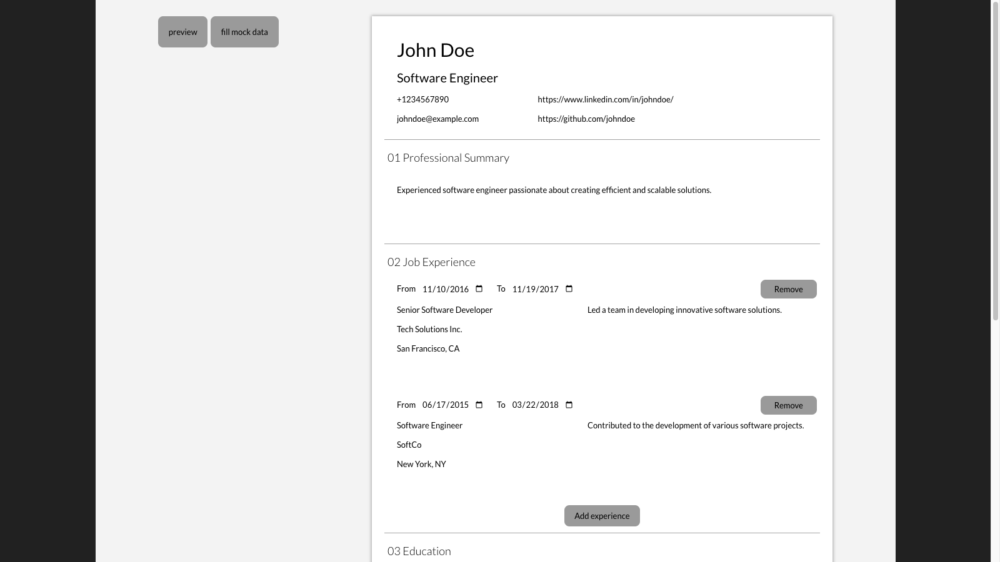

# CV App

This app allows users to quickly draft a CV and export them into a PDF. I used this project as an opportunity to hone my skills in ReactJS. In implementing this, I relied heavily on useState and useEffect React features.

## Table of Contents

- [Demo](#demo)
- [Features](#features)
- [How to Use](#how-to-use)
- [Known Issues](#known-issues)
- [Contributing](#contributing)
- [License](#license)

## Demo

You can view the app at [CV App Demo](https://main--chimerical-hummingbird-a514f5.netlify.app).

## Features

- CV preview
- converting to PDF and downloading
- fill out with mock data

## How To Use

- Simply fill out the form and click the "preview" button to preview it, and then from the preview, click "download" to download the PDF file
- Click "fill mock data" button to fill out the form with some mock data

## Known Issues

- Preview is glitchy when viewing from mobile devices
- Preview is glitchy in Safari browser if the screen width is less than 900px

## Contributing

Contributions are welcome! If you'd like to contribute to this project, please follow these guidelines:

1.  Fork the repository.
2.  Create a new branch for your feature or bug fix.
3.  Make your changes and commit them.
4.  Push your changes to your fork.
5.  Create a pull request.

## License

This project is licensed under the [MIT LICENSE](./LICENSE)
